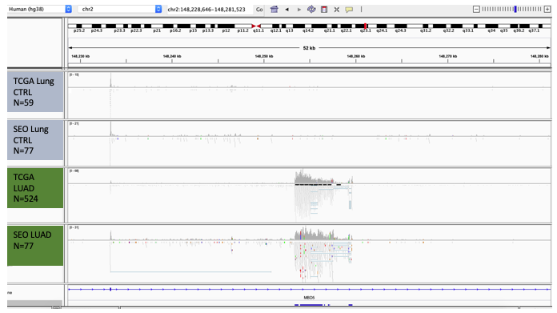

# meta-bam

This bash script produces a "meta-bam" file by :
- randomly sampling a given number of reads from a group of fastq(gz) file.
- aligning those reads to a reference genome using the STAR aligner.

An example result with 4 meta-bam files is shown in Fig. 1. 



Figure 1. IGV view of 4 meta-bam files created from 4 Lung adenocarcinoma datasets. 

## Dependencies

This script requires :
- **[reformat.sh](https://github.com/BioInfoTools/BBMap)** from BBMap, for random sampling of reads
- **[STAR](https://github.com/alexdobin/STAR)** Version 2.7.0f was tested, but all versions should work

Both dependencies can be downloaded as so, or directly installed on a conda environment, using :
```
conda install -c bioconda star
conda install -c bioconda bbmap
```

## Preparation

STAR needs an indexed genome. To create your index, follow the steps in part 2 of the STAR manual (http://labshare.cshl.edu/shares/gingeraslab/www-data/dobin/STAR/STAR.posix/doc/STARmanual.pdf)

## How to Run it ?

Once all dependencies are installed (or your conda environment activated), run the script as follows:
```
./meta-bam.sh dataType fastQList NbTotalReads referenceGenome
```

The parameters are :
- dataType = -SE or -PE, for single-end of paired-end data 
- fastQList = A text file containing paths to every fastq.gz to sample from (can be single-end or paired-end data)
- NbTotalReads = An integer: millions of reads to keep in the final BAM file (input 5 means 5'000'000). With option -PE: NbTotalReads are sampled in each R1 and R2 file, retaining read pairs.
- referenceGenome = Path to the reference genome index for STAR alignment

Example :
```
./meta-bam.sh -PE listFastQgz.txt 50 data/indexStar
```

## Final folder hierarchy

Every result can be found in the meta-bam-out folder :
```
├── meta-bam
│   ├── meta-bam.sh
│   ├── README.md
│   ├── listFastQgz.txt
│   ├── data
│   │   ├── indexStar
│   │   │   ├── SA
│   │   │   ├── SAindex
│   │   │   ├── {several other index files}
│   ├── meta-bam-out
│   │   ├── sample_R1.fq
│   │   ├── sample_R2.fq
│   │   ├── STARoutputLog.out
│   │   ├── STARoutputLog.progress.out
│   │   ├── STARoutputSJ.out.tab
│   │   ├── STARoutputLog.final.out
│   │   ├── STARoutputAligner.out.sam
```

A typical fastQList file is provided in exampleFastqFile.txt.
Note that the path to the actual fastq.gz files can be either relative or absolute.
For paired-end data, each pair must be side by side in the file.

## Processing time

Runtime depends on the size of your input dataset (both individual size file and number of files) and sampling depth.

The random sampling needs to open and read each file entirely, so this step is usually the limiting one.

Example runtimes:
- 50M reads from 108 paired-end libraries of mean size 2Gb/file (gzipped) :
Sampling : 5 hours, Alignment : 15 minutes

- 50M reads from 369 paired-end libraries of mean size 2Gb/file (gzipped) :
Sampling : 15 hours, Alignment : 17 minutes

*Sampling time for one file ranges from 4 minutes (2Gb fastq.gz) to 6 minutes (10Gb fastq.gz), with 1 million reads sampled.*
